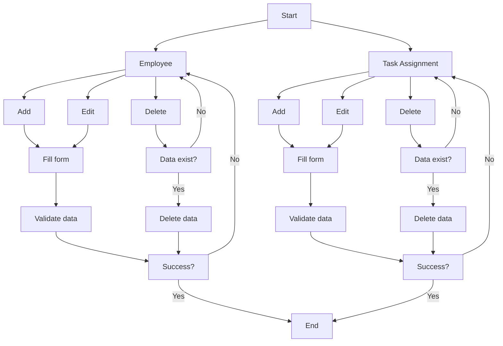

# WorkPay
## Overview
WorkPay is an employee task tracking application equipped with remuneration calculations. This application allows each employee to record the details of the tasks they have completed, including task descriptions, hours worked, hourly rates, and additional costs if any. Moreover, if the task involves multiple employees, the application automatically prorates the remuneration based on each employee’s contribution in hours worked. With these features, WorkPay aims to simplify the management of tasks and employee remuneration in a transparent and accurate manner. This project is developed as a qualification requirement for the **Fullstack Developer** position at **PT. AIC**.

## Flowchart Diagram

## Design Explanation: Remuneration Calculation Integration
WorkPay integrates remuneration calculation by automatically computing the total remuneration based on the hours spent and the hourly rate for each task assigned to an employee. The data is stored in the database, ensuring seamless tracking of employee assignments and their corresponding payments. The backend handles the business logic, including the calculation and validation of data, while the API Gateway (WorkPay-API) facilitates communication between the front-end and backend services. This design ensures efficient task management and accurate remuneration processing for all employees.

## Challenge & Solution
### Challenge
The application required linking employees to tasks and calculating their remuneration based on hours worked and hourly rates. Initially, managing the data relationships between employees and tasks seemed overwhelming, especially when dealing with large datasets.

### Solution
 I implemented Laravel's Eloquent relationships (one-to-many and many-to-many) to manage the connections between employees and tasks efficiently. For calculating remuneration, I utilized computed fields in the backend to automate the process, making the app’s logic seamless and reducing manual data entry errors.

 

